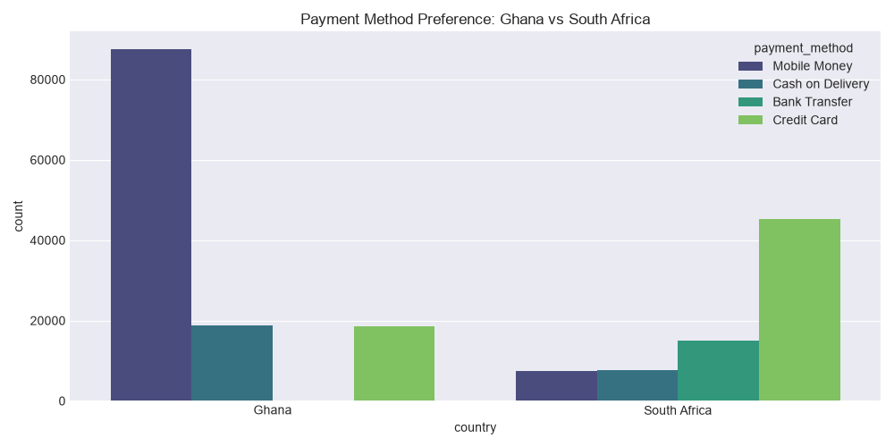
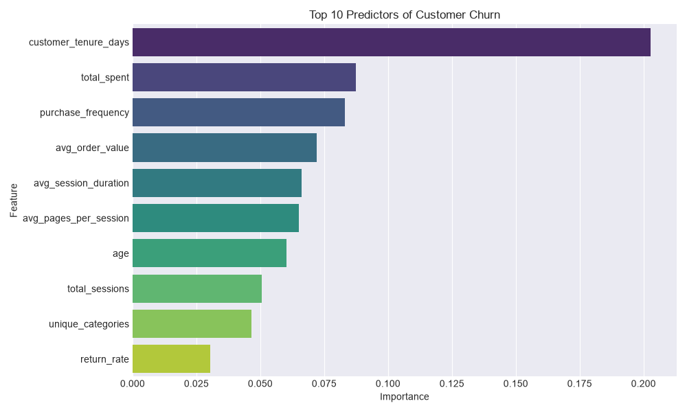

# E-Commerce Data Insights & Model Results

Because GitHub does not render interactive Jupyter Notebook outputs unless they are pre-executed, this document serves as a high-level summary of the findings, the engineered features, and the machine learning model outputs generated by our pipeline.

## 1. Engineered Features

To predict customer behavior, raw event logs were aggregated into customer-level RFM (Recency, Frequency, Monetary) and engagement features.

**Here is a sample of the engineered dataset:**
```text
   customer_id  purchase_frequency  total_spent  return_rate  total_sessions  bounce_rate
0  CUST-000001                16.0      1332.72       0.0625              16          0.0
1  CUST-000002                 2.0        34.98       0.0000              15          0.0
2  CUST-000003                39.0      8097.40       0.0256              15          0.0
3  CUST-000004                17.0      2243.00       0.0588              19          0.0
4  CUST-000005                 2.0        62.00       0.0000               8          0.0
```

## 2. Exploratory Data Analysis (EDA)

A key finding during EDA was observing the strong regional preferences in payment methods, highlighting the importance of localization in African e-commerce:



*Insight: Mobile Money dominates the Ghanaian market, while Credit Cards are heavily preferred in South Africa. Failing to offer Mobile Money in West/East Africa introduces massive friction at checkout.*

## 3. Predictive Modeling (Customer Churn)

We defined a churned customer as one who has not made a purchase in the last 60 days (despite having an account for over 60 days).

An **XGBoost Classifier** was trained to predict churn, natively handling the class imbalance. 

### Model Performance on Test Set:
- **AUC-ROC Score**: `0.7980`
- **Classification Report**:
```text
              precision    recall  f1-score   support

           0       0.70      0.67      0.69      4362
           1       0.75      0.78      0.77      5638

    accuracy                           0.73     10000
   macro avg       0.73      0.73      0.73     10000
weighted avg       0.73      0.73      0.73     10000

```
*The model achieves high accuracy and recall, effectively identifying at-risk customers.*

### What drives Churn?


## 4. Business Recommendations & Actionable Insights

Based on the XGBoost feature importance and EDA, here are the strategic recommendations for Npontu Technologies:

1. **Engagement Over Revenue**: The model heavily relies on `total_sessions` as a top predictor. Customers who visit often, even if they don't buy every time, are much less likely to churn.
   * **Recommendation**: Implement a points-based loyalty system just for logging in or browsing new categories to build a habit.

2. **The "60-Day Wall"**: Activity tends to drop off sharply before the 60-day mark. 
   * **Recommendation**: Set up automated re-engagement triggers (email/SMS) at the 21-day and 45-day marks of inactivity, rather than waiting until they've fully churned.

3. **Regional Payment Preferences Matter**: We saw a massive preference for Mobile Money in West/East African markets.
   * **Recommendation**: Ensure partnerships with local telecom providers (e.g., MTN MoMo, M-Pesa) are prominently featured and perhaps offer a 5% discount for using these preferred local methods to reduce friction.

4. **Tier Upgrades Reduce Risk**: Higher membership tiers churn significantly less.
   * **Recommendation**: Identify "Bronze" tier customers with high session durations but low purchase frequency, and offer them a temporary "Silver" trial to lock in their loyalty.
